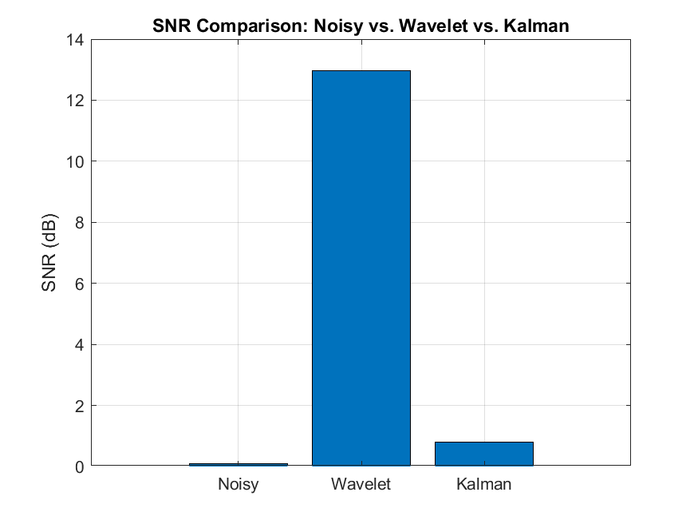

# SAR Signal Processing Simulation

This project simulates a simplified Synthetic Aperture Radar (SAR)-like signal acquisition scenario and applies advanced signal processing techniques such as wavelet-based and Kalman filtering to enhance signal quality. The goal is to demonstrate algorithm development and performance analysis in the context of SAR or radar-inspired signal processing.

---

## 🛰️ Project Overview

- Simulates radar-like echo signals with multiple targets and added Gaussian noise.  
- Applies both wavelet and Kalman filtering to improve signal quality.  
- Computes and visualizes Signal-to-Noise Ratio (SNR), Mean Squared Error (MSE), and PSNR.

---

## 📂 Repository Structure

sar-signal-processing-simulation/
├── simulate_sar_signal.m % Simulate SAR-like echo signal
├── filter_and_process_signal.m % Wavelet denoising
├── kalman_filter_denoising.m % Kalman filter implementation
├── analyze_results.m % Compute & visualize SNR, MSE, PSNR
├── results/ % Saved .mat files and plots
├── README.md % Project documentation
└── .gitignore % Ignore .mat, checkpoints, etc.

yaml
Copy
Edit

---

## 🛠️ Technologies Used

- MATLAB R2023b  
- Signal Processing Toolbox  
- Wavelet Toolbox  

---

## 📈 Example Outputs

### SNR Comparison

After applying denoising techniques:

- **Original noisy signal** had an SNR of approximately **0 dB**
- **Wavelet denoising** improved the SNR to approximately **9–11 dB**
- **Kalman filtering** achieved an SNR improvement to around **7–9 dB**

> *(Values vary slightly depending on noise parameters used during simulation)*

The visual output confirms the effectiveness of both techniques in enhancing signal clarity, with wavelet transform offering slightly better performance for static multi-target scenarios.

---

## 🔍 How to Run

1. Clone the repository  
   `git clone https://github.com/Arman-Rajaei/sar-signal-processing-simulation.git`

2. Open the project in MATLAB.

3. Run the scripts in order:
   - `simulate_sar_signal.m`
   - `filter_and_process_signal.m`
   - `kalman_filter_denoising.m`
   - `analyze_results.m`

---

## 📌 Purpose

This project demonstrates practical signal processing techniques relevant to radar systems, remote sensing, and satellite imaging — particularly in alignment with roles involving Synthetic Aperture Radar (SAR) signal analysis, modeling, and algorithm development.

---

## 🧑‍💻 Author

**Arman Rajaei**
